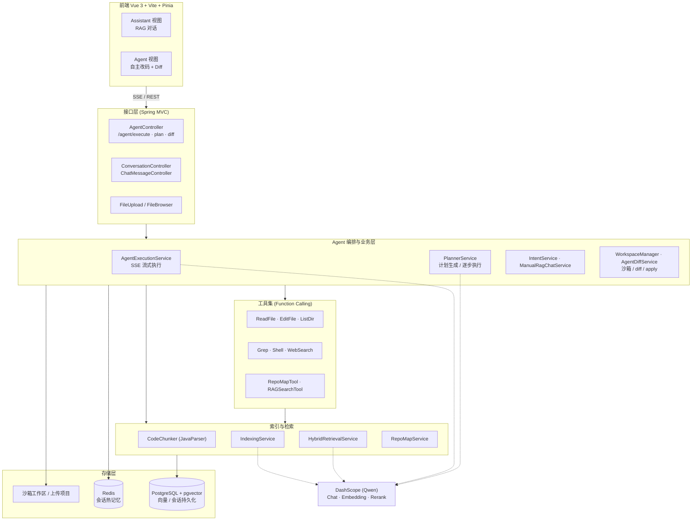
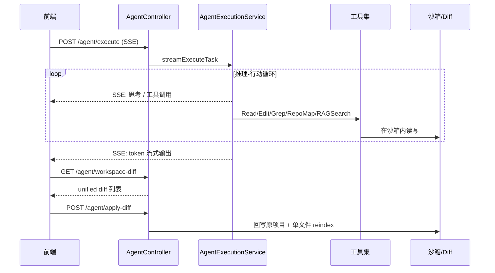

<div align="center">

# CodeMate · 智能编程助手 Agent

**基于 Spring AI Alibaba Agent Framework 构建的代码库级 AI 编程智能体**

面向真实工程仓库的「对话式 RAG 问答 + 自主 Agent 改码」平台：上传项目即可索引、检索、提问，并让 Agent 在隔离沙箱内自主读写代码、生成计划、产出可审阅的 diff 后一键应用回原项目。


</div>

---

## 一、项目简介

CodeMate 是一个**代码库级（repo-aware）的 AI 编程智能体**。它不是简单的「把问题丢给大模型」，而是围绕一个真实项目仓库，完成 **索引 → 检索 → 推理 → 改码 → 审阅 → 应用** 的完整闭环：

- **RAG 助手模式**：对上传的项目做代码分块与向量化，基于**混合检索（向量 + 关键词 + RepoMap）**回答关于本仓库的问题，答案带出处。
- **Agent 自主改码模式**：Agent 在**隔离沙箱**中，通过 Read / Edit / Grep / Shell / RepoMap / RAGSearch / WebSearch 等工具自主完成任务；支持**先生成计划、用户审阅后再逐步执行**；改动以 **unified diff** 呈现，确认后**增量回写**到原项目并**单文件重建索引**（毫秒级）。
- **全程 SSE 流式**：规划、工具调用、token 输出实时推送到前端。

## 二、核心特性

| 能力 | 说明 |
| --- | --- |
| 两级会话记忆 | Redis 热数据 + PostgreSQL 持久化；超出 token 预算的旧消息自动摘要压缩 |
| 混合检索 | 向量语义检索 + 关键词检索 + RepoMap 结构信号融合，召回更准 |
| RepoMap 代码地图 | 基于 JavaParser 解析符号/依赖，生成仓库结构地图供 Agent 定位 |
| 工作区沙箱 | 每个会话独立沙箱，Agent 改动与原项目隔离，24h 未修改自动清理 |
| Diff 审阅与应用 | 计算沙箱 vs 原项目的 unified diff，一键应用 + 增量 reindex |
| 计划-执行分离 | 先出 Plan（可编辑），确认后带 `plan_step_start/done` 事件逐步执行 |
| 专业技能库 | `skills/` 下的 Markdown 技能在启动时加载，注入 Agent 提示 |
| 多模型可切换 | DashScope（Qwen 系列）Chat / Embedding / Rerank |
| JDK 21 虚拟线程 | Tomcat 请求处理与 `@Async` 自动走虚拟线程，高并发低开销 |

## 三、系统架构



### 请求主链路（Agent 执行）



## 四、技术栈

**后端**
- Spring Boot 3.5.14 / Java 21（虚拟线程）
- Spring AI Alibaba Agent Framework 1.1.2.0 + DashScope Starter（Qwen Chat / Embedding / Rerank）
- PostgreSQL + pgvector（`spring-ai-starter-vector-store-pgvector`）
- Redis（会话热记忆）
- MyBatis-Plus 3.5.15（会话与消息持久化）
- JavaParser 3.26.2（代码分块 / RepoMap 符号解析）
- java-diff-utils 4.12（unified diff 计算）
- Hutool 5.8.37

**前端**
- Vue 3 + Vue Router 4 + Pinia（持久化插件）
- Vite 5、Axios、marked（Markdown 渲染）、SSE 流式消费

## 五、快速开始

### 环境要求
- JDK 21、Maven 3.9+
- PostgreSQL 14+（安装 `pgvector` 扩展）、Redis 6+
- Node.js 18+
- DashScope API Key（可选：Web 搜索 API Key）

### 1. 配置密钥（绝不写死在仓库里）
项目通过环境变量或本地 profile 注入密钥。**方式一：环境变量**

```bash
export DASHSCOPE_API_KEY=你的key
export SEARCH_API_KEY=你的key        # 可选
export DB_PASSWORD=你的数据库密码
export REDIS_PASSWORD=你的redis密码   # 若无密码可留空
```

**方式二：本地 profile（推荐本地开发）**
在 `src/main/resources/` 下新建 `application-local.yml`（该文件已被 `.gitignore` 忽略，不会提交）：

```yaml
spring:
  datasource:
    password: 你的数据库密码
  data:
    redis:
      password: 你的redis密码
  ai:
    dashscope:
      api-key: 你的key
search-api:
  api-key: 你的key
```
IDEA 中把 Active profiles 设为 `local` 即自动加载。

### 2. 启动后端
```bash
mvn spring-boot:run
# 默认端口 8082
```

### 3. 启动前端
```bash
cd mycode-agent-frontend
npm install
npm run dev
```

## 六、目录结构

```
mycode-agent/
├── src/main/java/com/zsc/
│   ├── config/         # AI / 向量库 / Redis / CORS / 全局异常
│   ├── controller/     # Agent / 会话 / 文件上传与浏览 接口
│   ├── indexing/       # 代码分块、索引、混合检索、RepoMap
│   ├── tools/          # Agent 工具集（Read/Edit/Grep/Shell/RepoMap/RAG/Web）
│   ├── service/        # Agent 编排、规划、意图、RAG、沙箱、diff
│   ├── memory/         # 两级会话记忆仓库
│   ├── context/        # 会话上下文构建
│   ├── mapper/ entity/ dto/ vo/
│   └── MycodeAgentApplication.java
├── src/main/resources/ # application.yml（占位符）、mapper XML
├── skills/             # 内置专业技能（Markdown，启动时加载）
└── mycode-agent-frontend/  # Vue 3 前端
```

## 七、设计亮点

- **两级记忆 + 摘要压缩**：`TwoLevelChatMemoryRepository` 以 Redis 承载热数据、PostgreSQL 持久化；超出 `agent-max-tokens` 预算时对旧消息生成摘要，兼顾上下文完整性与 token 成本。
- **混合检索**：`HybridRetrievalService` 融合向量语义、关键词与 RepoMap 结构信号，缓解纯向量检索在代码场景的召回偏差。
- **RepoMap 代码地图**：`RepoMapService` + JavaParser 抽取符号与依赖，为 Agent 提供「先看地图再定位」的能力。
- **沙箱隔离 + 可审阅 diff**：每会话独立工作区，改动先落沙箱，用 java-diff-utils 计算 unified diff 供人工审阅，确认后回写并**仅对改动文件增量重建索引**（毫秒级），避免全量重建。
- **计划-执行分离**：先产出可编辑的 Plan，再带步骤事件流式执行，过程可观测、可干预。
- **全链路 SSE**：规划、工具调用、token 输出实时流式返回，前端体验接近主流 AI 编程工具。

## 八、License

本项目采用 MIT License。
